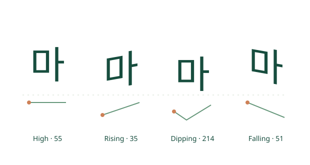

# MarkHangeul 1.0 · Draw the sounds of the world in Hangul

[한국어](README.md) · **English**

**Hangeul Day 2026 · Whoborn Inc.**

Every year, Whoborn Inc. celebrates Hangeul Day with an event honoring King Sejong's creation of Hangul. This year, we have been exploring how Hangul can represent the pronunciation of as many of the world's languages as possible. We introduce **MarkHangeul**, an open-source Markdown tool for expressing the pitch, duration and other features of syllables.

We invite everyone to explore the source code, write their own examples, and connect the tool to their editors and services. Together, we can explore new possibilities for Hangul.

**Hangeul Day, October 9, 2026 — With best wishes, [Whoborn Inc.](https://whoborn.net)**



[English introduction](https://whoborn.github.io/MarkHangeul/index.en.html) · [Try the editor](https://whoborn.github.io/MarkHangeul/preview.html) · [Integration demo](https://whoborn.github.io/MarkHangeul/integration.en.html)

> These are the intended Whoborn deployment URLs. They become available after the repository is made public and GitHub Pages deployment is complete. Korean is the default site language; choose **English** in the navigation to switch. The editor interface is currently in Korean.
>
> The distribution is a **JavaScript, WebAssembly and CSS web renderer**, not an installable TTF, OTF or WOFF font. It uses system fonts and transforms letter shapes to express pitch and duration. Hangul transcriptions are learning approximations, not automatic transcription of all languages or a replacement for IPA.

## Get started in 30 seconds

1. Open the editor and add pronunciation annotations after Hangul text.
2. Compare the pitch and width of the letters in the live preview.
3. Save annotated Markdown, plain Markdown, standalone HTML or JSON. Edits are not saved automatically.

```md
# Express pronunciation in Hangul
마{T1} 마{T2} 마{T3} 마{T4}
마{lang=yue,tone=6}
마{toneContour=214,duration=long}
((안녕하세요)){pitch=rise}
**아{——!}**
```

- Pitch: `pitch=rise`, `toneContour=214` (1 = low, 5 = high).
- Duration: seven levels, including `duration=short`, `normal` and `long`.
- Stress: `stress=strong` or `!`.
- Mandarin's four tones, Cantonese's six tones, Hanoi Vietnamese's six/six-plus-two categories, and Thai's five tones, with phonation and checked-syllable guides.
- Twelve pronunciation profiles across eleven languages, including English, French, German and Arabic. Choose original script + Hangul, Hangul only, or original script only.
- Markdown tables, emphasis, lists, code and math. User-supplied HTML is not executed.

Ordinary Markdown viewers do not display the pitch and width transformations. Use static examples and live-demo links in GitHub README files. Export standalone HTML to share the transformed letters. Math remains TeX source in exported HTML.

[Notation reference (Korean)](docs/SYNTAX.md) · [Language profiles and limits (Korean)](docs/LANGUAGE-PROFILES.md) · [Web SDK guide](docs/INTEGRATION.en.md)

## Connect an editor or service

```html
<script type="module" src="https://whoborn.github.io/MarkHangeul/sdk/markhangeul.js"></script>
<mark-hangeul source="마{T2} 아{duration=long}"></mark-hangeul>
```

```js
import { init, renderMarkdown } from
  'https://whoborn.github.io/MarkHangeul/sdk/markhangeul.js';
await init();
preview.innerHTML = renderMarkdown(markdownSource);
```

Load `sdk/markhangeul.css` when using the function API. The Web Component loads and isolates its styles automatically. This is an API accepting Markdown source, not an installable plugin for a specific editor. VS Code, Obsidian and similar hosts require their own integration plugin. The SDK runs without a conversion server or API key.

## Local development and builds

```sh
rustup target add wasm32-unknown-unknown
cargo install --locked trunk --version 0.21.14
cargo install --locked wasm-bindgen-cli --version 0.2.121
cargo test --workspace --locked
./scripts/build-site.sh /MarkHangeul/
```

Deploy the entire `dist/` directory. For a domain-root deployment, use `./scripts/build-site.sh /`. Serve the files over HTTP(S) with the WASM MIME type `application/wasm`. Do not open the application with `file://`; exported standalone HTML can be opened directly.

For editor development, run `env -u NO_COLOR trunk serve` and open `http://localhost:8080/`. To view the introduction and SDK too, run the full build and serve the generated files with a static HTTP server.

```sh
cargo fmt --all -- --check
cargo clippy --workspace --all-targets --locked -- -D warnings
cargo check --workspace --target wasm32-unknown-unknown --locked
```

## Project structure

```text
site/                       Introduction, guides and SDK demo (Korean/English)
sdk/                        Browser API and Web Component
crates/markhangeul-core/     Parser, AST and language-specific tones
crates/markhangeul-render/   Shared Markdown/SVG renderer
crates/markhangeul-sdk/      Public WASM functions
crates/markhangeul-web/      Live editor
assets/styles/              Renderer and editor styles
scripts/                    Static-site build and validation
.github/workflows/          Checks, SDK generation and Pages deployment
```

The old React prototype, superseded planning documents and development audit reports have been removed from the current tree. Git retains their history. Build caches, screenshots and node_modules are excluded from the public source files.

## Publishing under Whoborn

The [publishing guide (Korean)](docs/PUBLISHING.md) explains account ownership, authentication and Pages setup. On a `main` push or manual workflow run, GitHub Actions builds the site and SDK together and deploys them to Pages. The distribution ZIP contains runtime files, documentation and licenses, not development caches.

The intended repository owner is `whoborn`. Previous `baesic` commits can remain in the Git history. Creating the new repository requires authentication with the appropriate account; transferring the existing repository to another personal account requires the recipient to accept it. These preparations do not mean the repository has already been published.

The Pages SDK URL follows the latest deployment. To pin a version, build a specific commit and host its files yourself.

## License

MIT · Copyright © 2026 Whoborn Inc. Bae Young Sik. Include [LICENSE](LICENSE) when using, modifying or distributing the software. No font files are bundled; the renderer uses the user's available fonts. Word and IPA sources are linked from the language examples.
