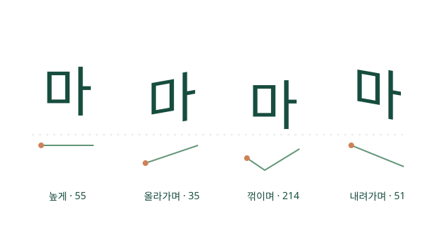

# MarkHangeul 1.0 · 한글로 그리는 세계의 소리

**한국어** · [English](README.en.md)

**2026 한글날 · 주식회사 후본(Whoborn Inc.)**

주식회사 후본은 매년 세종대왕님의 한글 창제 정신을 기리고 한글날을 기념하는 한글 이벤트를 실시하고 있습니다. 올해는 한글을 바탕으로 가능한 한 세계 여러 언어의 발음을 표현하는 방법을 연구하여, 음절의 높낮이와 길이 등을 자유롭게 표기할 수 있는 Markdown 기반 오픈소스 도구 **MarkHangeul**을 선보입니다.

누구나 소스코드를 살펴보고, 직접 글을 쓰고, 자신의 편집기나 서비스에 연결하며 한글의 가능성을 함께 넓혀 가기를 바랍니다.

**2026년 10월 9일 한글날, [주식회사 후본](https://whoborn.net) 올림**



[소개 사이트](https://whoborn.github.io/MarkHangeul/) · [체험 편집기](https://whoborn.github.io/MarkHangeul/preview.html) · [연동 체험](https://whoborn.github.io/MarkHangeul/integration.html)

> 현재 제공물은 **JavaScript·WebAssembly·CSS 웹 렌더러**입니다. 설치형 TTF/OTF/WOFF 폰트 파일은 포함하지 않습니다. 기존 시스템 글꼴로 글자를 그리고 높낮이·장평을 변형합니다. 한글은 학습용 근사이며 모든 언어의 자동 전사기나 IPA 대체 표준이 아닙니다.

## 30초 사용법

1. 체험 편집기를 열어 한글 뒤에 발음 주석을 적습니다.
2. 오른쪽 미리보기에서 글자의 높낮이·너비를 비교합니다.
3. 원문 Markdown, 일반 Markdown, 독립 HTML 또는 JSON으로 저장합니다. 입력은 자동 저장되지 않습니다.

```md
# 한글로 소리를 표현하기
마{T1} 마{T2} 마{T3} 마{T4}
마{lang=yue,tone=6}
마{toneContour=214,duration=long}
((안녕하세요)){pitch=rise}
**아{——!}**
```

- 높낮이: `pitch=rise`, `toneContour=214` (1=낮음, 5=높음)
- 길이: `duration=short`, `normal`, `long` 등 7단계
- 강세: `stress=strong` / `!`
- 중국어 4성·광둥어 6성·하노이 6/6+2범주·태국어 5성, 발성·입성 보조표시
- 영어·프랑스어·독일어·아랍어 등 11개 언어, 12개 발음 프로필에서 원어+한글/한글/원어 선택
- Markdown 표·강조·목록·코드·수식. 사용자 HTML은 실행하지 않음

일반 Markdown 뷰어에서는 높낮이·장평 변형을 표시하지 않습니다. GitHub README에서는 정적 예제와 체험 링크를 사용하세요. 변형된 글자를 그대로 공유하려면 독립 HTML로 저장합니다. HTML 내보내기의 수식은 TeX 원문으로 남습니다.

[표기 문법](docs/SYNTAX.md) · [언어와 표현 범위](docs/LANGUAGE-PROFILES.md) · [웹 SDK 사용법](docs/INTEGRATION.md)

## 내 편집기·서비스에 연결

```html
<script type="module" src="https://whoborn.github.io/MarkHangeul/sdk/markhangeul.js"></script>
<mark-hangeul source="마{T2} 아{duration=long}"></mark-hangeul>
```

```js
import { init, renderMarkdown } from
  'https://whoborn.github.io/MarkHangeul/sdk/markhangeul.js';
await init();
preview.innerHTML = renderMarkdown(markdownSource);
```

함수 방식은 `sdk/markhangeul.css`를 함께 로드하세요. Web Component는 스타일을 자동 로드하고 격리합니다. Markdown 원문을 입력받으며, 특정 편집기의 설치 플러그인이 아닌 연결용 API입니다. VS Code·Obsidian 등의 플러그인은 별도로 작성해야 합니다. SDK는 서버나 API 키 없이 실행됩니다.

## 로컬 개발과 빌드

```sh
rustup target add wasm32-unknown-unknown
cargo install --locked trunk --version 0.21.14
cargo install --locked wasm-bindgen-cli --version 0.2.121
cargo test --workspace --locked
./scripts/build-site.sh /MarkHangeul/
```

`dist/` 전체가 배포물입니다. 루트 배포는 `./scripts/build-site.sh /`를 사용합니다. HTTP(S) 서버에서 제공하며 WASM MIME은 `application/wasm`입니다. `file://`에서 앱을 열지 마세요. 독립 HTML 내보내기는 직접 열 수 있습니다.

편집기 개발: `env -u NO_COLOR trunk serve` 후 `http://localhost:8080/` 접속. 소개 사이트 및 SDK까지 확인하려면 전체 빌드 후 정적 서버를 실행하세요.

```sh
cargo fmt --all -- --check
cargo clippy --workspace --all-targets --locked -- -D warnings
cargo check --workspace --target wasm32-unknown-unknown --locked
```

## 간결한 프로젝트 구조

```text
site/                       소개·사용법·SDK 연동 체험
sdk/                        브라우저 API와 Web Component
crates/markhangeul-core/     파서·AST·언어별 성조
crates/markhangeul-render/   공통 Markdown/SVG 렌더러
crates/markhangeul-sdk/      WASM 공개 함수
crates/markhangeul-web/      체험 편집기
assets/styles/              렌더러·편집기 스타일
scripts/                    정적 사이트 빌드
.github/workflows/          검사·SDK 생성·Pages 배포
```

이전 React 시제품, 과거 기획 문서, 개발 점검 보고서는 현재 트리에서 제거했습니다. 변경 이력은 Git에 보존합니다. 빌드 캐시·스크린샷·node_modules는 공개 파일에 포함하지 않습니다.

## Whoborn 공개와 GitHub Actions

[공개 절차](docs/PUBLISHING.md)에 소유 계정·인증·Pages 설정을 정리했습니다. `main` push 또는 수동 실행 시 사이트와 SDK를 함께 생성하고 Pages에 배포합니다. 배포 아티팩트와 ZIP에는 실행 파일·문서·라이선스만 포함합니다. Pages 주소는 최신 배포에 따라 갱신되므로 버전을 고정하려면 특정 커밋을 빌드하여 자체 호스팅하세요.

## 라이선스

MIT · Copyright © 2026 Whoborn Inc. Bae Young Sik. 사용·수정·배포 시 [LICENSE](LICENSE)를 포함하세요. 별도 폰트를 번들하지 않으며 사용 환경의 글꼴을 이용합니다. 단어·IPA 출처는 언어별 예제에 표시합니다.
